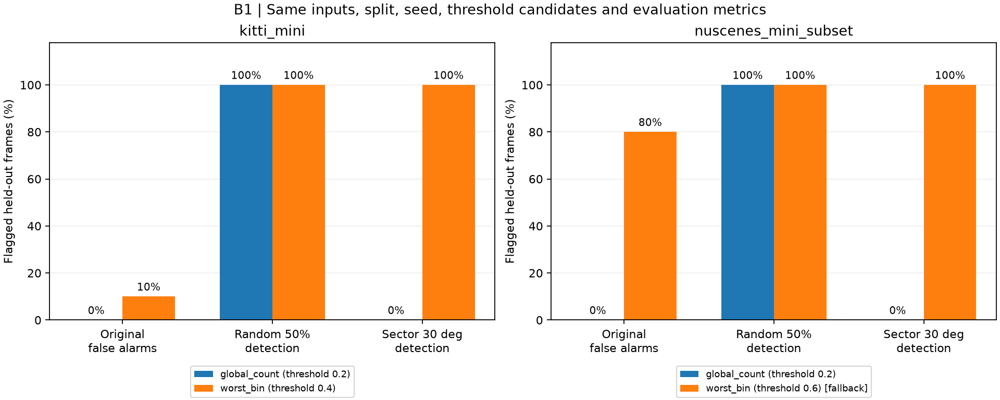
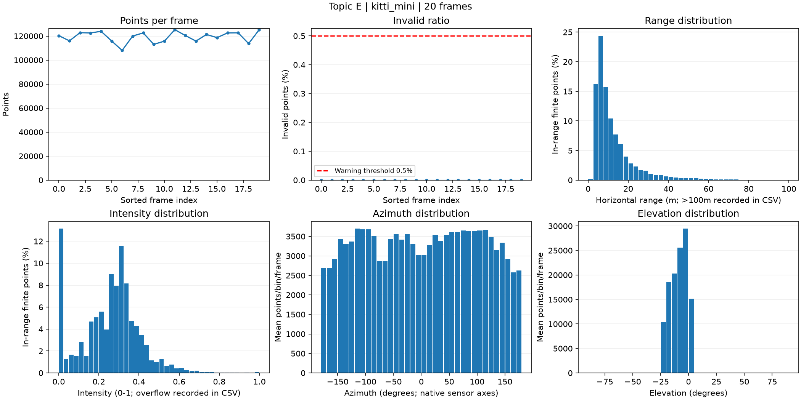
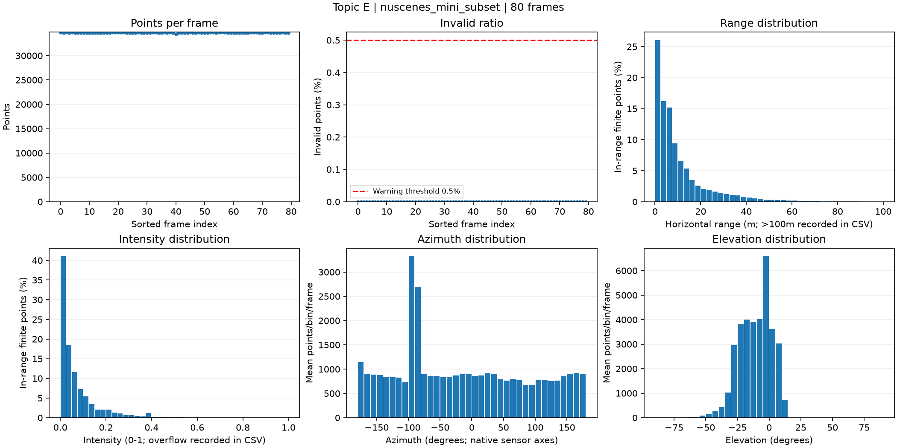
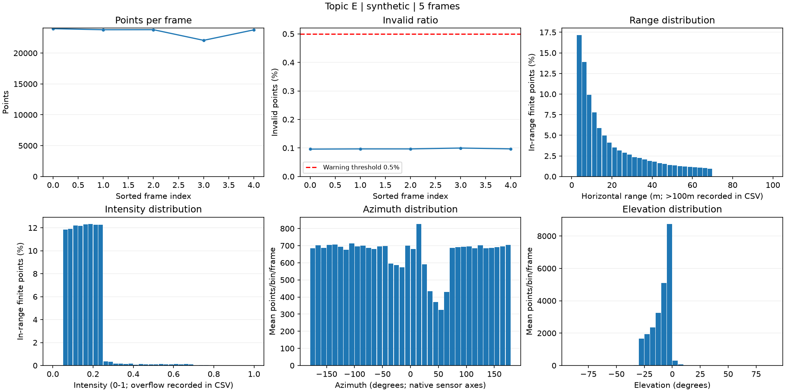

# Bằng chứng chi tiết

Tài liệu phụ cho [REPORT.md](REPORT.md); giữ các bảng CP3, bonus và phân tích failure có thể tái tạo từ code.

## 2. Evidence

CP3 chạy 100 frame thật × 7 cấu hình (gốc + random dropout 10/30/50% + sector dropout 10/20/30°), rồi quét ngưỡng 0,2/0,4/0,6: tổng 700 cấu hình dữ liệu và 2.100 dòng cảnh báo; seed 42.
Reference là median số điểm và median mật độ từng ô azimuth 10° trên nhóm calibration; score = clip(max(1 − n/reference_n, max_bin(1 − bin_count/reference_bin)), 0, 1); chỉ dùng ô reference > 0 và cảnh báo khi score > ngưỡng.
Tách calibration/test chẵn/lẻ từ trước; nuScenes tách riêng từng scene. Chọn ngưỡng nhỏ nhất trong ba ứng viên có báo nhầm calibration ≤10%; KITTI chọn 0,4. nuScenes không có ngưỡng đạt mục tiêu, nên 0,6 chỉ là fallback để mô tả thất bại, không phải cấu hình đạt claim.

| Dataset | Ngưỡng | Báo nhầm trên gốc | Phát hiện dropout 50% | Phát hiện mất sector 30° |
|---|---:|---:|---:|---:|
| kitti_mini | 0.2 | 5/10 (50%) | 10/10 (100%) | 10/10 (100%) |
| kitti_mini | 0.4 | 1/10 (10%) | 10/10 (100%) | 10/10 (100%) |
| kitti_mini | 0.6 | 0/10 (0%) | 6/10 (60%) | 10/10 (100%) |
| nuscenes_mini_subset | 0.2 | 39/40 (97.5%) | 40/40 (100%) | 40/40 (100%) |
| nuscenes_mini_subset | 0.4 | 37/40 (92.5%) | 40/40 (100%) | 40/40 (100%) |
| nuscenes_mini_subset | 0.6 | 32/40 (80%) | 40/40 (100%) | 40/40 (100%) |

**[B2] Stress test (+3):** hai loại từ `starter.perturb` × ba mức: random dropout 10/30/50% và sector dropout 10/20/30°, có mức gốc 0, seed 42, giữ nguyên frame/reference/ngưỡng khi đổi mức. Plot bên dưới cho thấy mức suy giảm theo score và khả năng gắn cờ; số liệu từng cấu hình ở `health_scores.csv`/`health_threshold_sweep.csv`. Đây là phần mở rộng ngoài yêu cầu chính E về quét ngưỡng trên dữ liệu gốc.

KITTI: tăng ngưỡng từ 0,2 lên 0,6 làm báo nhầm giảm 50% → 0%, nhưng phát hiện dropout 50% giảm 100% → 60%; mất sector 30° vẫn đạt 100%.
nuScenes: báo nhầm giảm 97,5% → 80% khi tăng ngưỡng 0,2 → 0,6; mean score gốc của scene-0103/scene-1094 là 0,648/0,657 dù median số điểm đều 34.720. Score cực trị của một ô góc nhạy với hình học cảnh; số beam và điều kiện cảnh khác nhau nên không dùng chung reference giữa sensor, và kết quả này không tách riêng tác động của ánh sáng.
Bảng coi dữ liệu gốc là nhóm âm đối chứng; đây là tỷ lệ cảnh báo trên gốc, chưa chứng minh mọi frame gốc không có lỗi sensor. Hai tập nuScenes liền kề theo thời gian nên kết quả chưa chứng minh tổng quát sang scene mới.

Số liệu: `results/health_scores.csv` (metric từng cấu hình), `health_threshold_sweep.csv` (tham số/ngưỡng/cờ/lý do), `health_summary.csv` (tổng hợp calibration/test), `health_selected.csv` (ngưỡng chọn và kết quả test), `health_reference.csv` (reference chỉ từ calibration). Chạy lần hai: cả 5 CSV **GIỐNG HỆT từng byte**; thư mục kiểm tra tạm đã xoá.

**[B1] So sánh hai cách cảnh báo (+4):** `global_count` dùng clip(1 − finite_points/reference_n, 0, 1); `worst_bin` là score kết hợp tổng điểm và ô xấu nhất của CP3. Cùng 700 input, split, seed, reference từ calibration, ứng viên ngưỡng 0,2/0,4/0,6 và metric đánh giá tỷ lệ phát hiện/báo trên gốc; cùng quy tắc chọn ngưỡng chỉ từ calibration. Đây là so sánh hai cách làm, không chỉ lặp lại sweep ngưỡng của E.

| Dataset | Cách | Ngưỡng | Báo trên gốc | Phát hiện dropout 50% | Phát hiện sector 30° |
|---|---|---:|---:|---:|---:|
| kitti_mini | global_count | 0.2 | 0/10 (0%) | 10/10 (100%) | 0/10 (0%) |
| kitti_mini | worst_bin | 0.4 | 1/10 (10%) | 10/10 (100%) | 10/10 (100%) |
| nuscenes_mini_subset | global_count | 0.2 | 0/40 (0%) | 40/40 (100%) | 0/40 (0%) |
| nuscenes_mini_subset | worst_bin | 0.6 fallback | 32/40 (80%) | 40/40 (100%) | 40/40 (100%) |

`global_count` ít báo trên gốc và bắt dropout đồng đều, nhưng bỏ sót toàn bộ sector 30° trên cả hai nhóm test (10/10 KITTI, 40/40 nuScenes). `worst_bin` bắt mất sector, nhưng báo nhầm theo đối chứng: 10% KITTI, 80% nuScenes; failure cụ thể ở mục 3. Không cách nào đạt toàn bộ claim trên cả hai dataset; chưa đề xuất kết hợp hai cách như một giải pháp đã được kiểm chứng.
Bằng chứng: `health_method_runs.csv` (4.200 dòng: hai cách × 700 input × ba ngưỡng), `health_method_summary.csv`, `health_method_selected.csv`; chạy lại cả ba CSV giống từng byte. Ở nuScenes ngưỡng worst_bin 0,6 là fallback, không đạt mục tiêu calibration.

**[B3] Latency (+2):** đo trích metric và quyết định trên frame gốc có sẵn trong RAM, CPU i5-13420H, RAM 15,7 GB, Intel UHD Graphics (không dùng GPU). Mỗi dataset/cách bỏ một warmup, sau đó 30 lần `perf_counter`: CSV có 120 dòng; tính p50/p95 bằng percentile 50/95.

| Dataset / frame | Cách | Số lần sau warmup | p50 (ms) | p95 (ms) |
|---|---|---:|---:|---:|
| kitti_mini / 000011 | global_count | 30 | 1.366 | 2.138 |
| kitti_mini / 000011 | worst_bin | 30 | 6.560 | 8.233 |
| nuscenes_mini_subset / scene-0103_010 | global_count | 30 | 0.444 | 0.665 |
| nuscenes_mini_subset / scene-0103_010 | worst_bin | 30 | 3.949 | 4.789 |

Phạm vi `global_count`: lọc hữu hạn → đếm → score → flag; `worst_bin`: lọc hữu hạn → histogram 36 ô → score → flag. Không gồm đọc file, fit reference, tạo dropout hay vẽ ảnh; không suy ra latency toàn hệ thống hoặc khả năng thời gian thực. Timing thay đổi theo tải máy khi chạy lại; dữ liệu, score và tham số vẫn cố định. Bằng chứng: `health_latency.csv`, `health_latency_summary.csv`, `health_latency_hardware.json`.

Baseline CP2: self-test và overlay synthetic/KITTI/nuScenes khớp 3910/19946/3120 điểm; yaw +2° có 3956 điểm nhưng lệch khỏi cột, nên số điểm trong FOV không đủ kiểm tra alignment.

## 3. Failure case

- **Trường hợp:** nuScenes `scene-0103_035`, nhóm test, dữ liệu gốc không perturb, ngưỡng fallback 0,6; bị báo nhầm theo quy ước gốc là đối chứng âm của CP3 (không khẳng định sensor thật chắc chắn sạch).
- **Quan sát:** 34.720 điểm hữu hạn = reference tổng điểm, invalid = 0%, không có ô góc trống, nhưng score = 0,818900 > 0,6 nên bị gắn cờ.
- **Nguyên nhân:** ô azimuth [-100°, -90°) có 550 điểm so với median calibration 3.037: hụt 81,89%; deficit tổng điểm = 0. Phép lấy max trên 36 ô khiến một thay đổi phân bố theo góc chi phối toàn bộ score. Histogram chứng minh sự khác biệt với reference, chưa chứng minh có mất dữ liệu hay nguyên nhân vật lý của sự khác biệt.
- **Lớp debug:** **Metric** — dùng mật độ khác median để suy ra lỗi sensor mà chưa phân biệt tái phân bố theo cảnh với dropout. Reader, dữ liệu gốc và phép chiếu đã qua kiểm tra; thí nghiệm này chỉ dùng LiDAR, không dùng camera/timestamp, không dùng model hay voxel/range filter.
- **Cách phát hiện khi chạy thật:** log total_count, invalid_ratio, empty_bins, worst_bin và reference; nếu score >0,6 nhưng tổng điểm lệch <5%, invalid ≤0,5% và empty_bins = 0 thì gắn “cần review phân bố” thay vì tự loại frame. Đây là quy tắc chẩn đoán đề xuất, chưa được benchmark; cần reference theo bối cảnh và xác nhận bằng log sensor/chuỗi frame.

- **Trường hợp:** KITTI `000021`, nhóm test, random dropout giữ 50% với seed 42, thử ngưỡng lỏng 0,6 của sweep; đây không phải ngưỡng KITTI 0,4 được chọn ở CP3.
- **Quan sát:** 125.260 → 62.348 điểm (mất thực tế 50,23%), score 0,109763 → 0,554524, vẫn không báo vì 0,554524 ≤0,6. Trong toàn bộ test KITTI, ngưỡng 0,6 bỏ sót 4/10 frame dropout 50%.
- **Nguyên nhân:** reference tổng điểm 120.851,5 cho deficit toàn cục 0,484094; ô xấu nhất [-170°, -160°) có 1.248/2.801,5 điểm, deficit 0,554524. Dropout phân bố đều không tạo ô trống, nên score tăng nhưng chưa vượt ngưỡng; tăng ngưỡng để giảm báo nhầm đánh đổi trực tiếp khả năng phát hiện.
- **Lớp debug:** **Metric** — ngưỡng quyết định quá lỏng cho mức suy giảm cần phát hiện; perturbation có chủ đích, seed cố định, không sửa dữ liệu gốc.
- **Cách phát hiện khi chạy thật:** với KITTI dùng ngưỡng 0,4 được chọn bằng calibration ở CP3: frame này được báo; kết quả test là phát hiện 10/10 dropout 50%, báo nhầm 1/10 gốc. Theo dõi thêm rolling median số điểm và dropout theo từng ô; chưa chứng minh ngưỡng này tổng quát sang sensor/scene mới.

Kiểm tra loại trừ: checksum nuScenes 173/173 PASS; `src.test_projection` PASS; CP4 tính lại score từ raw points và assert khớp CSV CP3. Số liệu từng failure ở `results/health_failure_details.csv`.
**Giải thích 30 giây:** “Metric lấy ô góc hụt nhiều nhất, nên nuScenes có đủ tổng điểm vẫn bị báo khi một ô lệch khỏi median. Ngược lại, khi tăng ngưỡng lên 0,6, KITTI mất hơn nửa số điểm vẫn bị bỏ sót. Cần log cả số điểm tổng và phân bố góc, chọn ngưỡng trên calibration, và xem cảnh báo như tín hiệu review chứ chưa đủ kết luận sensor hỏng.”

## Dashboard đầy đủ và ranking

`src.dataset_health_dashboard` tạo histogram range/intensity, mật độ azimuth/elevation, số điểm, invalid_ratio, time gap và cờ kèm lý do trên 105 frame; ranking ưu tiên review bằng density_score giảm dần theo từng dataset.
KITTI không có timestamp; synthetic đọc `training/timestamps.txt`; nuScenes đọc timestamp từ metadata bằng reader starter. Time gap synthetic 000003 là 0,2 s so với median 0,1 s, bị gắn cờ khi nằm ngoài ±20%. nuScenes dùng expected gap 0,5 s; camera sớm hơn LiDAR khoảng 34–40 ms.
Ngưỡng invalid >0,5%, empty bins >0, time gap ngoài ±20% và density_score > ngưỡng CP3 đều được ghi lý do trong `dataset_health_frames.csv`. Đây là cờ review, không phải nhãn sensor hỏng; không khẳng định tìm được mọi lỗi synthetic, không đề nghị B6.

| Nhóm | Frame | Median điểm | Mean intensity | Mean range p95 (m) | Median gap (s) | Cờ review |
|---|---:|---:|---:|---:|---:|---:|
| KITTI | 20 | 120340 | 0,253206 | 33,538 | Không có timestamp | 2 |
| nuScenes scene-0103 | 40 | 34720 | 0,058811 | 31,806 | 0,499876 | 33 |
| nuScenes scene-1094 | 40 | 34720 | 0,080462 | 40,951 | 0,499885 | 33 |
| synthetic | 5 | 23781 | 0,158679 | 58,241 | 0,1 | 1 |

Mean intensity và range khác nhau giữa hai scene nhưng chưa tách được tác động ánh sáng, vật liệu, khoảng cách và bối cảnh; không diễn giải intensity là độ sáng ảnh camera. Ranking phản ánh ưu tiên kiểm tra do metric, chưa được chứng minh là chất lượng nhãn hoặc giá trị retrain.

CSV bổ sung: `dataset_health_frames.csv`, `dataset_health_histograms.csv`, `dataset_scene_summary.csv`, `frame_review_ranking.csv`.
