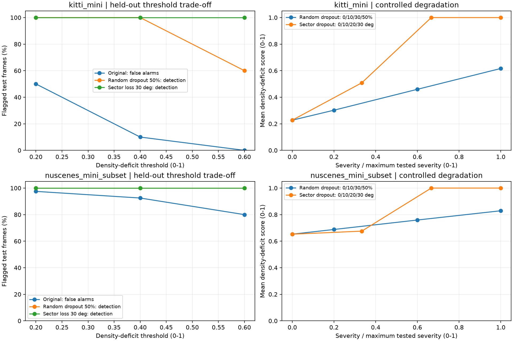
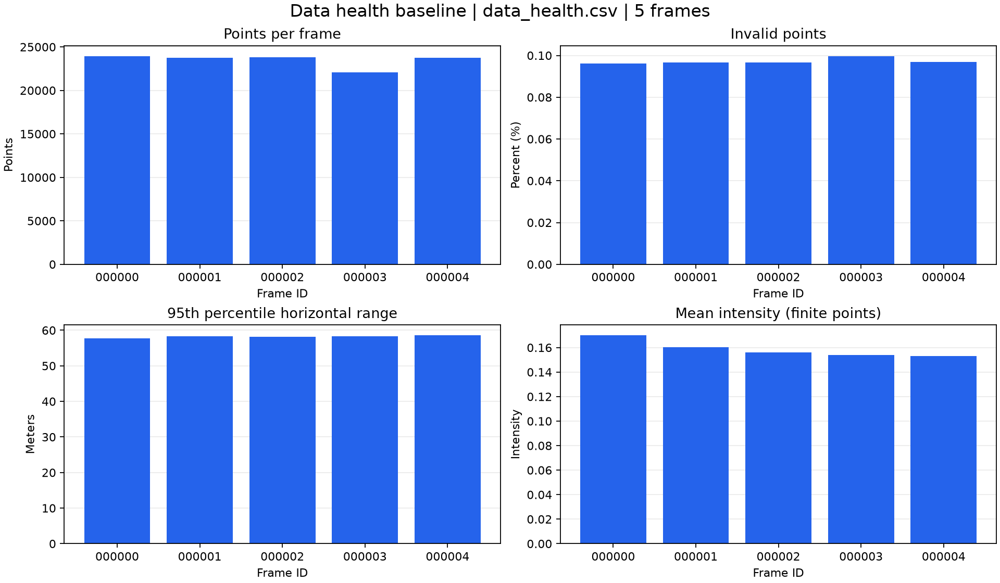
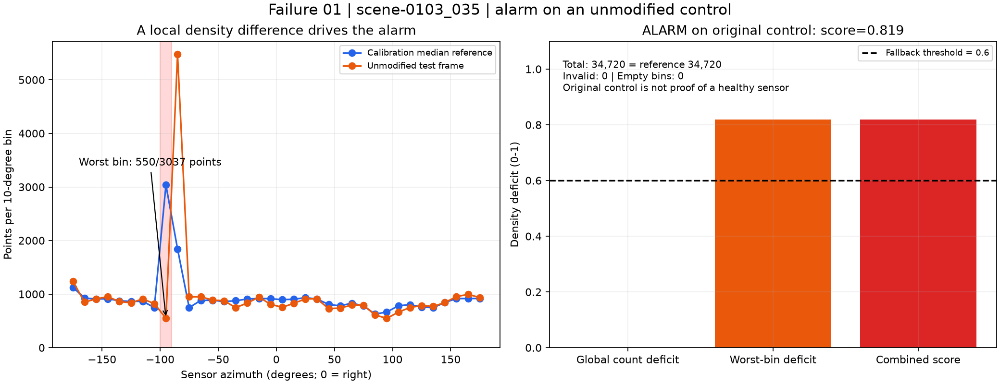
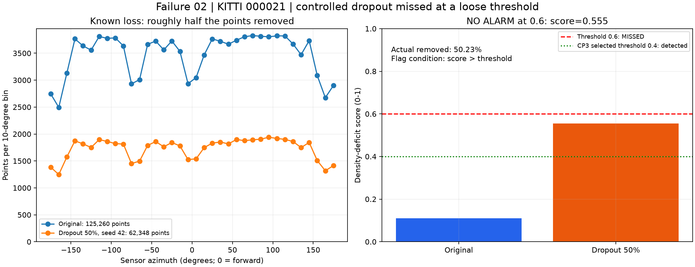

# Báo cáo Day 6: Phát hiện suy giảm LiDAR bằng mật độ góc quét

> Thay **mọi** ô có chữ ĐIỀN nằm trong ngoặc vuông bằng nội dung của bạn, xoá luôn cả dấu ngoặc vuông. Lệnh `python tools/check_submission.py` sẽ báo FAIL nếu còn sót bất kỳ chỗ nào.

- **Họ tên:** Nguyễn Đức Anh
- **MSSV:** 2A202602625
- **Lớp:** AI20K-T4
- **Link repo:** https://github.com/Munfond/NguyenDucAnh-2A202602625-Track4-Day21
- **Topic:** E — Data health dashboard (mục tiêu Advanced)
- **Dataset:** data/synthetic (debug và kiểm tra lỗi); data/kitti_mini và data/nuscenes_mini_subset (thí nghiệm chính).
- **Các frame đã dùng:** CP3 đã chạy thí nghiệm trên toàn bộ frame thật dưới đây; synthetic dùng cho CP0/CP2:
  - Synthetic: 000000, 000001, 000002, 000003, 000004.
  - KITTI: 000001, 000004, 000007, 000008, 000009, 000010, 000011, 000012, 000015, 000016, 000019, 000021, 000023, 000025, 000031, 000032, 000043, 000048, 000049, 000061.
  - nuScenes: scene-0103_000 đến scene-0103_039 và scene-1094_000 đến scene-1094_039 (đủ 80 frame).

> Hãy viết ngắn: mỗi mục từ 3 đến 8 dòng, ưu tiên số liệu và hình ảnh.

## 1. Claim

**Claim ban đầu (CP1):** Trên KITTI và nuScenes, cảnh báo dùng mật độ góc quét chuẩn hóa theo từng dataset phát hiện được ít nhất 90% frame bị random dropout 50% hoặc mất sector 30°, với tỷ lệ báo nhầm không quá 10% trên dữ liệu gốc.

Mình sẽ đo tỷ lệ phát hiện, tỷ lệ báo nhầm và mật độ góc quét trên 20 frame KITTI và 80 frame nuScenes, với random dropout 10/30/50% và sector dropout 10/20/30°, kèm mức gốc 0; seed cố định 42.
Chọn ngưỡng trên các frame có thứ tự chẵn trong danh sách đã sắp xếp, đánh giá trên các frame thứ tự lẻ (đánh số từ 0; nuScenes chia riêng từng scene); báo cáo metric riêng theo dataset và loại suy giảm.
Dùng synthetic để debug; ảnh minh họa chọn KITTI 000008, 000011, 000049 và nuScenes scene-0103_000, scene-0103_020, scene-1094_000, scene-1094_020.
Quan sát CP0: synthetic 000003 có 22.063 điểm, so với 23.760–23.953 ở các frame còn lại, nhưng mọi frame đều có 0 ô azimuth trống; cần kiểm tra mật độ chi tiết để xác định nguyên nhân và khả năng bỏ sót của quy tắc ô trống.
**Kết luận CP3:** claim ban đầu bị bác bỏ trên tập thử này: KITTI đạt 100% phát hiện hai loại suy giảm mạnh và 10% báo nhầm ở ngưỡng 0,4, nhưng nuScenes báo nhầm 80% ngay tại ngưỡng 0,6. Không suy luận nhân quả ngày/đêm từ hai scene khác nhau.

## 2. Evidence

CP3 chạy 100 frame thật × 7 cấu hình (gốc + random dropout 10/30/50% + sector dropout 10/20/30°), rồi quét ngưỡng 0,2/0,4/0,6: tổng 700 cấu hình dữ liệu và 2.100 dòng cảnh báo; seed 42.
Reference là median số điểm và median mật độ từng ô azimuth 10° trên nhóm calibration; score = clip(max(1 − n/reference_n, max_bin(1 − bin_count/reference_bin)), 0, 1); chỉ dùng ô reference > 0 và cảnh báo khi score > ngưỡng.
Tách calibration/test chẵn/lẻ từ trước; nuScenes tách riêng từng scene. Chọn ngưỡng nhỏ nhất trong ba ứng viên có báo nhầm calibration ≤10%; KITTI chọn 0,4. nuScenes không có ngưỡng đạt mục tiêu, nên 0,6 chỉ là fallback để mô tả thất bại, không phải cấu hình đạt claim.

| Dataset | Ngưỡng | Báo nhầm trên gốc | Phát hiện dropout 50% | Phát hiện mất sector 30° |
|---|---:|---:|---:|---:|
| kitti_mini | 0.2 | 5/10 (50%) | 10/10 (100%) | 10/10 (100%) |
| kitti_mini | 0.4 | 1/10 (10%) | 10/10 (100%) | 10/10 (100%) |
| kitti_mini | 0.6 | 0/10 (0%) | 6/10 (60%) | 10/10 (100%) |
| nuscenes_mini_subset | 0.2 | 39/40 (97.5%) | 40/40 (100%) | 40/40 (100%) |
| nuscenes_mini_subset | 0.4 | 37/40 (92.5%) | 40/40 (100%) | 40/40 (100%) |
| nuscenes_mini_subset | 0.6 | 32/40 (80%) | 40/40 (100%) | 40/40 (100%) |



KITTI: tăng ngưỡng từ 0,2 lên 0,6 làm báo nhầm giảm 50% → 0%, nhưng phát hiện dropout 50% giảm 100% → 60%; mất sector 30° vẫn đạt 100%.
nuScenes: báo nhầm giảm 97,5% → 80% khi tăng ngưỡng 0,2 → 0,6; mean score gốc của scene-0103/scene-1094 là 0,648/0,657 dù median số điểm đều 34.720. Score cực trị của một ô góc nhạy với hình học cảnh; số beam và điều kiện cảnh khác nhau nên không dùng chung reference giữa sensor, và kết quả này không tách riêng tác động của ánh sáng.
Bảng coi dữ liệu gốc là nhóm âm đối chứng; đây là tỷ lệ cảnh báo trên gốc, chưa chứng minh mọi frame gốc không có lỗi sensor. Hai tập nuScenes liền kề theo thời gian nên kết quả chưa chứng minh tổng quát sang scene mới.

Số liệu: `results/health_scores.csv` (metric từng cấu hình), `health_threshold_sweep.csv` (tham số/ngưỡng/cờ/lý do), `health_summary.csv` (tổng hợp calibration/test), `health_selected.csv` (ngưỡng chọn và kết quả test), `health_reference.csv` (reference chỉ từ calibration). Chạy lần hai: cả 5 CSV **GIỐNG HỆT từng byte**; thư mục kiểm tra tạm đã xoá.

Baseline CP2: self-test và overlay synthetic/KITTI/nuScenes khớp 3910/19946/3120 điểm; yaw +2° có 3956 điểm nhưng lệch khỏi cột, nên số điểm trong FOV không đủ kiểm tra alignment.


## 3. Failure case



- **Trường hợp:** nuScenes `scene-0103_035`, nhóm test, dữ liệu gốc không perturb, ngưỡng fallback 0,6; bị báo nhầm theo quy ước gốc là đối chứng âm của CP3 (không khẳng định sensor thật chắc chắn sạch).
- **Quan sát:** 34.720 điểm hữu hạn = reference tổng điểm, invalid = 0%, không có ô góc trống, nhưng score = 0,818900 > 0,6 nên bị gắn cờ.
- **Nguyên nhân:** ô azimuth [-100°, -90°) có 550 điểm so với median calibration 3.037: hụt 81,89%; deficit tổng điểm = 0. Phép lấy max trên 36 ô khiến một thay đổi phân bố theo góc chi phối toàn bộ score. Histogram chứng minh sự khác biệt với reference, chưa chứng minh có mất dữ liệu hay nguyên nhân vật lý của sự khác biệt.
- **Lớp debug:** **Metric** — dùng mật độ khác median để suy ra lỗi sensor mà chưa phân biệt tái phân bố theo cảnh với dropout. Reader, dữ liệu gốc và phép chiếu đã qua kiểm tra; thí nghiệm này chỉ dùng LiDAR, không dùng camera/timestamp, không dùng model hay voxel/range filter.
- **Cách phát hiện khi chạy thật:** log total_count, invalid_ratio, empty_bins, worst_bin và reference; nếu score >0,6 nhưng tổng điểm lệch <5%, invalid ≤0,5% và empty_bins = 0 thì gắn “cần review phân bố” thay vì tự loại frame. Đây là quy tắc chẩn đoán đề xuất, chưa được benchmark; cần reference theo bối cảnh và xác nhận bằng log sensor/chuỗi frame.



- **Trường hợp:** KITTI `000021`, nhóm test, random dropout giữ 50% với seed 42, thử ngưỡng lỏng 0,6 của sweep; đây không phải ngưỡng KITTI 0,4 được chọn ở CP3.
- **Quan sát:** 125.260 → 62.348 điểm (mất thực tế 50,23%), score 0,109763 → 0,554524, vẫn không báo vì 0,554524 ≤0,6. Trong toàn bộ test KITTI, ngưỡng 0,6 bỏ sót 4/10 frame dropout 50%.
- **Nguyên nhân:** reference tổng điểm 120.851,5 cho deficit toàn cục 0,484094; ô xấu nhất [-170°, -160°) có 1.248/2.801,5 điểm, deficit 0,554524. Dropout phân bố đều không tạo ô trống, nên score tăng nhưng chưa vượt ngưỡng; tăng ngưỡng để giảm báo nhầm đánh đổi trực tiếp khả năng phát hiện.
- **Lớp debug:** **Metric** — ngưỡng quyết định quá lỏng cho mức suy giảm cần phát hiện; perturbation có chủ đích, seed cố định, không sửa dữ liệu gốc.
- **Cách phát hiện khi chạy thật:** với KITTI dùng ngưỡng 0,4 được chọn bằng calibration ở CP3: frame này được báo; kết quả test là phát hiện 10/10 dropout 50%, báo nhầm 1/10 gốc. Theo dõi thêm rolling median số điểm và dropout theo từng ô; chưa chứng minh ngưỡng này tổng quát sang sensor/scene mới.

Kiểm tra loại trừ: checksum nuScenes 173/173 PASS; `src.test_projection` PASS; CP4 tính lại score từ raw points và assert khớp CSV CP3. Số liệu từng failure ở `results/health_failure_details.csv`.
**Giải thích 30 giây:** “Metric lấy ô góc hụt nhiều nhất, nên nuScenes có đủ tổng điểm vẫn bị báo khi một ô lệch khỏi median. Ngược lại, khi tăng ngưỡng lên 0,6, KITTI mất hơn nửa số điểm vẫn bị bỏ sót. Cần log cả số điểm tổng và phân bố góc, chọn ngưỡng trên calibration, và xem cảnh báo như tín hiệu review chứ chưa đủ kết luận sensor hỏng.”

## 4. Khuyến nghị nếu triển khai thật

Use-case: công cụ QA log LiDAR của robot giao hàng, xếp frame bất thường để kỹ sư kiểm tra trước khi gán nhãn; chưa dùng score này để điều khiển phanh hay tự loại dữ liệu.
KITTI cho thấy ngưỡng 0,4 phát hiện đủ hai loại suy giảm mạnh nhưng còn 10% báo trên gốc; nuScenes cho thấy reference cố định theo dataset chưa đủ, cần kiểm tra theo bối cảnh và đánh giá trên scene mới.
Log tối thiểu: frame ID/timestamp, sensor ID, số điểm hữu hạn, invalid_ratio, histogram góc, worst_bin, reference/version, score, ngưỡng và lý do gắn cờ; khi đối chiếu camera cần log độ lệch thời gian và trạng thái bù chuyển động.
Đánh đổi: ngưỡng thấp tăng tải review, ngưỡng cao bỏ sót dropout; cảnh thưa tự nhiên có thể giống lỗi sensor. Giữ dữ liệu gốc, phân biệt cảnh báo mật độ và kết luận hỏng sensor, xác nhận bằng chuỗi frame và log phần cứng.
Bước tiếp theo: reference theo sensor/bối cảnh, kiểm tra nhóm ô liên tiếp thay cho một ô cực trị, đánh giá trên scene độc lập và đo latency của phần trích metric trên CPU trước khi tích hợp online.

## 5. Cách chạy lại

Chạy từ thư mục gốc repo trong PowerShell, dùng Python >=3.10; nếu đã có `.venv` thì bỏ lệnh tạo môi trường.

```powershell
py -3.12 -m venv .venv
.\.venv\Scripts\Activate.ps1
python -m pip install -r requirements.txt
python -m src.test_projection
python -m starter.projection --data-root data/synthetic --frame 000000
python -m starter.projection --data-root data/kitti_mini --frame 000011
python -m starter.projection --data-root data/nuscenes_mini_subset --frame scene-0103_010
python -m starter.projection --data-root data/synthetic --frame 000000 --yaw-deg 2
python -m starter.data_health --data-root data/synthetic --out results/data_health.csv
python -m src.data_health_dashboard --csv results/data_health.csv --out results/figures/dashboard_synthetic_cp2.png
python -m src.exp_health_sweep --seed 42 --thresholds 0.2 0.4 0.6 --out-dir results
python -m src.plot_health_sweep
python -m src.analyze_health_failure
```

Self-test kiểm tra điểm chuẩn `(10,0,0)`, NaN/Inf, điểm sau camera, FOV, biên ảnh, mảng rỗng và mẫu số chiếu bằng 0; đồng thời xác nhận số điểm trong ảnh của cả ba dataset.
Trên macOS/Linux, tạo môi trường bằng `python3 -m venv .venv` và kích hoạt bằng `source .venv/bin/activate`; các lệnh Python còn lại giữ nguyên.

## 6. Khai báo sử dụng AI

Ghi rõ đã dùng công cụ AI nào, dùng vào việc gì, và bạn đã tự kiểm chứng kết quả đó bằng cách nào. Nếu không dùng AI, ghi "Không sử dụng". Xem quy định ở `RULES.md` mục 2.

| Công cụ | Dùng cho việc gì | Bạn đã kiểm chứng thế nào |
|---|---|---|
| Codex | Hỗ trợ thiết lập CP0; đọc rubric, kiểm tra cấu hình máy, chọn topic E và soạn kế hoạch/claim nháp CP1; cài hai hàm phép chiếu CP2, self-test và dashboard baseline; viết thí nghiệm/quét ngưỡng CP3, plot và phân tích kết quả; tái hiện hai failure CP4 và viết phân tích nguyên nhân/lớp debug. Tái sử dụng reader và perturbation từ starter; không dùng script yaw mẫu làm thí nghiệm E. | Đã chạy kiểm tra import, checksum và thống kê CP0; đối chiếu topic/claim với CHECKPOINTS.md, TOPICS.md, RUBRIC.md và kiểm tra frame tồn tại. CP2 đã chạy self-test, xác nhận 3910/19946/3120 điểm và xem ảnh overlay/dashboard. CP3 đã chạy 700 cấu hình, kiểm tra score bằng dữ liệu có đáp án biết trước, so sánh cả 5 CSV lần chạy lại giống từng byte và xem biểu đồ; claim ban đầu bị bác bỏ trên nuScenes. CP4 đã tính lại score từ raw points, assert khớp CP3, kiểm tra checksum nuScenes và self-test phép chiếu, xem hai ảnh failure. Học viên cần tự chạy lại và giải thích kết quả. |
