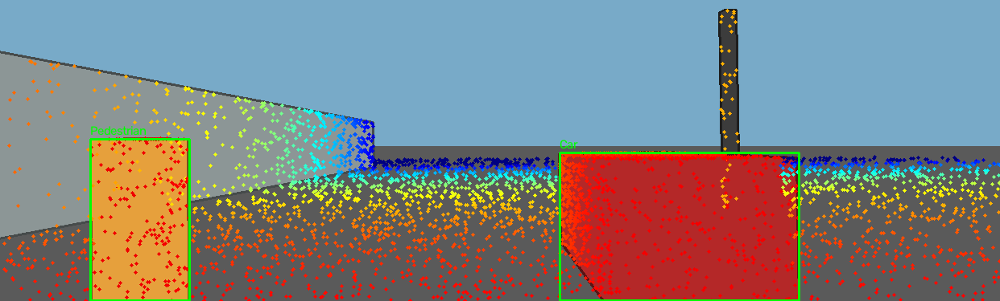
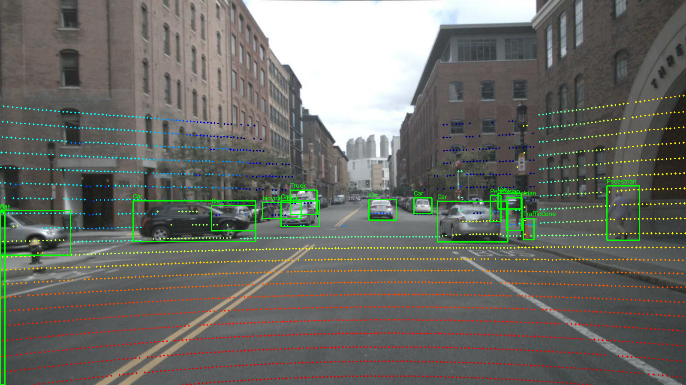

# Báo cáo Day 6: Phát hiện suy giảm LiDAR bằng mật độ góc quét

> Thay **mọi** ô có chữ ĐIỀN nằm trong ngoặc vuông bằng nội dung của bạn, xoá luôn cả dấu ngoặc vuông. Lệnh `python tools/check_submission.py` sẽ báo FAIL nếu còn sót bất kỳ chỗ nào.

- **Họ tên:** Nguyễn Đức Anh
- **MSSV:** 2A202602625
- **Lớp:** AI20K-T4
- **Link repo:** https://github.com/Munfond/NguyenDucAnh-2A202602625-Track4-Day21
- **Topic:** E — Data health dashboard (mục tiêu Advanced)
- **Dataset:** data/synthetic (debug và kiểm tra lỗi); data/kitti_mini và data/nuscenes_mini_subset (thí nghiệm chính).
- **Các frame đã dùng:** CP0 đã thống kê toàn bộ; CP1 chọn các frame sau cho thí nghiệm tiếp theo:
  - Synthetic: 000000, 000001, 000002, 000003, 000004.
  - KITTI: 000001, 000004, 000007, 000008, 000009, 000010, 000011, 000012, 000015, 000016, 000019, 000021, 000023, 000025, 000031, 000032, 000043, 000048, 000049, 000061.
  - nuScenes: scene-0103_000 đến scene-0103_039 và scene-1094_000 đến scene-1094_039 (đủ 80 frame).

> Hãy viết ngắn: mỗi mục từ 3 đến 8 dòng, ưu tiên số liệu và hình ảnh.

## 1. Claim

**Claim nháp (giả thuyết CP1, chưa có kết quả xác nhận):** Trên KITTI và nuScenes, cảnh báo dùng mật độ góc quét chuẩn hóa theo từng dataset phát hiện được ít nhất 90% frame bị random dropout 50% hoặc mất sector 30°, với tỷ lệ báo nhầm không quá 10% trên dữ liệu gốc.

Mình sẽ đo tỷ lệ phát hiện, tỷ lệ báo nhầm và mật độ góc quét trên 20 frame KITTI và 80 frame nuScenes, với random dropout 10/30/50% và sector dropout 10/20/30°, kèm mức gốc 0; seed cố định 42.
Chọn ngưỡng trên các frame có thứ tự chẵn trong danh sách đã sắp xếp, đánh giá trên các frame thứ tự lẻ (đánh số từ 0; nuScenes chia riêng từng scene); báo cáo metric riêng theo dataset và loại suy giảm.
Dùng synthetic để debug; ảnh minh họa chọn KITTI 000008, 000011, 000049 và nuScenes scene-0103_000, scene-0103_020, scene-1094_000, scene-1094_020.
Quan sát CP0: synthetic 000003 có 22.063 điểm, so với 23.760–23.953 ở các frame còn lại, nhưng mọi frame đều có 0 ô azimuth trống; cần kiểm tra mật độ chi tiết để xác định nguyên nhân và khả năng bỏ sót của quy tắc ô trống.
Các ngưỡng và kết luận sẽ được kiểm chứng hoặc sửa ở checkpoint sau; không coi khác biệt ngày/đêm giữa hai scene là bằng chứng nhân quả.

## 2. Evidence

Baseline CP2: self-test số và ba overlay khớp chính xác với hướng dẫn; claim về cảnh báo suy giảm ở mục 1 chưa được kiểm chứng.

| Dataset / frame | Tổng điểm | Điểm trong ảnh | Tỷ lệ |
|---|---:|---:|---:|
| synthetic / 000000 | 23953 | 3910 | 16,3% |
| KITTI / 000011 | 108004 | 19946 | 18,5% |
| nuScenes / scene-0103_010 | 34720 | 3120 | 9,0% |
| synthetic / 000000, yaw +2° | 23953 | 3956 | 16,5% |

Dashboard đầu tiên có 4 biểu đồ: số điểm/frame, tỷ lệ điểm lỗi, range p95 theo mặt phẳng XY và intensity trung bình của điểm hữu hạn; CSV đầu vào được tái tạo bằng lệnh ở mục 5.




Đã xem ảnh: điểm bám theo mặt đường, tường, xe và người; nuScenes có mật độ chiếu thưa hơn. Khi yaw +2°, điểm trượt khỏi cột dù tỷ lệ trong ảnh tăng nhẹ: metric FOV không đủ để kiểm tra alignment.


## 3. Failure case

Nêu khi nào hệ thống hoặc phương pháp fail, vì sao fail, và liên hệ tới lớp nào trong 6 lớp debug: I/O, Geometry, Time, Preprocess, Model, Metric.


[ĐIỀN]

## 4. Khuyến nghị nếu triển khai thật

Use-case cụ thể (ADAS / robot / drone), trade-off và bước tiếp theo.

[ĐIỀN]

## 5. Cách chạy lại

Chạy từ thư mục gốc repo trong PowerShell, dùng Python >=3.10; nếu đã có `.venv` thì bỏ lệnh tạo môi trường.

```powershell
py -3.12 -m venv .venv
.\.venv\Scripts\Activate.ps1
python -m pip install -r requirements.txt
python -m src.test_projection
python -m starter.projection --data-root data/synthetic --frame 000000
python -m starter.projection --data-root data/kitti_mini --frame 000011
python -m starter.projection --data-root data/nuscenes_mini_subset --frame scene-0103_010
python -m starter.projection --data-root data/synthetic --frame 000000 --yaw-deg 2
python -m starter.data_health --data-root data/synthetic --out results/data_health.csv
python -m src.data_health_dashboard --csv results/data_health.csv --out results/figures/dashboard_synthetic_cp2.png
```

Self-test kiểm tra điểm chuẩn `(10,0,0)`, NaN/Inf, điểm sau camera, FOV, biên ảnh, mảng rỗng và mẫu số chiếu bằng 0; đồng thời xác nhận số điểm trong ảnh của cả ba dataset.
Trên macOS/Linux, tạo môi trường bằng `python3 -m venv .venv` và kích hoạt bằng `source .venv/bin/activate`; các lệnh Python còn lại giữ nguyên.

## 6. Khai báo sử dụng AI

Ghi rõ đã dùng công cụ AI nào, dùng vào việc gì, và bạn đã tự kiểm chứng kết quả đó bằng cách nào. Nếu không dùng AI, ghi "Không sử dụng". Xem quy định ở `RULES.md` mục 2.

| Công cụ | Dùng cho việc gì | Bạn đã kiểm chứng thế nào |
|---|---|---|
| Codex | Hỗ trợ thiết lập CP0; đọc rubric, kiểm tra cấu hình máy, chọn topic E và soạn kế hoạch/claim nháp CP1; cài hai hàm phép chiếu CP2, self-test và dashboard baseline. | Đã chạy kiểm tra import, checksum và thống kê CP0; đối chiếu topic/claim với CHECKPOINTS.md, TOPICS.md, RUBRIC.md và kiểm tra frame tồn tại. CP2 đã chạy self-test, xác nhận 3910/19946/3120 điểm và xem ảnh overlay/dashboard. Claim CP1 chưa được thực nghiệm; học viên cần tự chạy lại và giải thích kết quả. |
